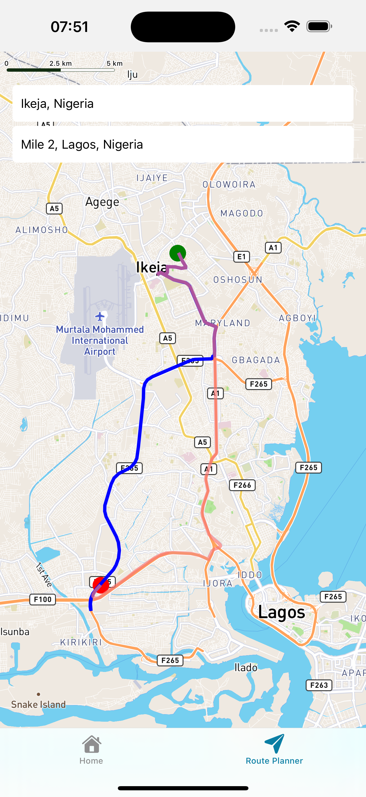

# Transport Tracking App
This Transport Tracking App is built with Expo React Native.

Transport Tracking App allows you to track train locations in real time (currently restricted to KTMB (Keretapi Tanah Melayu Berhad). A railway operator providing train services across Malaysia). 

Transport Tracking App also allows you to get route suggestions based on a start point and end point and the suggested routes can be accessed both offline and online.

<br>

## Features

- Used https://developer.data.gov.my/realtime-api/gtfs-realtime to get realtime data of train locations of KTMB agency. (Note : At present, this GTFS Realtime API only offers vehicle position data - service alerts and and trip updates are in our pipeline for 2024-25.)
- Used Redux Toolkit (for global state management) and RTK Query (for API integration).
- Used MapBox SDK for interactive maps and location services.
- Used expo-sqlite for local data storage.
- Used https://api.mapbox.com directions to get the route between two points and also to get alternative routes if available.
- Used react-native-google-places-autocomplete library to get the coordinates of a given address.

## Screenshots

### Home


### Route Planner


## ✨ Requirements

- Any Operating System (ie. MacOS X, Linux, Windows)
- Any IDE with node and expo cli installed (ie. VSCode)
- A little knowledge of React Native and JavaScript 

## Run locally

1. Install dependencies
   ```bash
   git clone https://github.com/lexican/TransportTrackingApp.git
   cd TransportTrackingApp
   npm install
   npx expo start
   ```

2. Start the app
   On Android emulator
   ```bash
    npx expo run android
   ```

   On IOS simulator
   ```bash
    npx expo run android
   ```
   
